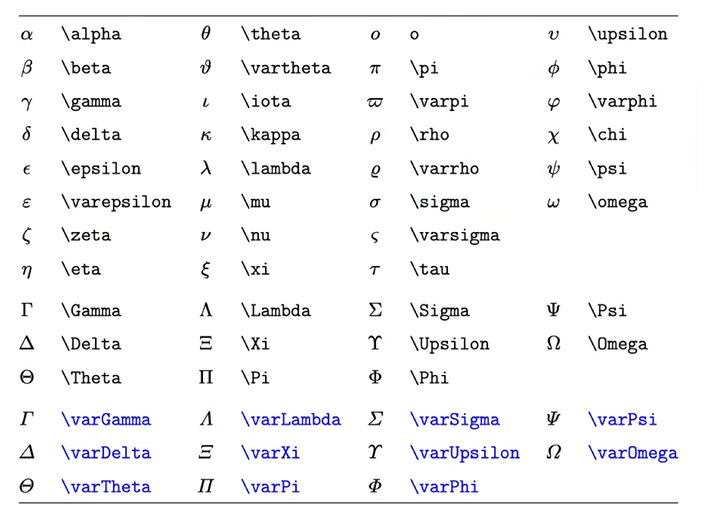
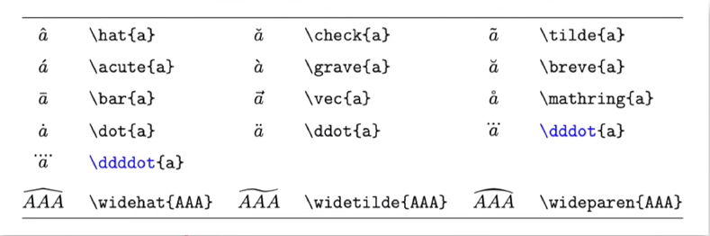

# Latex

1. **`希腊字母`**
   $$
    \alpha,\beta,\gamma,\delta,\epsilon,\varepsilon,\eta,\theta,\pi,\rho,\sigma,\Phi,\omega,\varphi,
    $$
    
    $$
    \Delta,\Pi,\Sigma
    $$
    
    
    
2. **`上下标` ’_’ ’^’ \rm \text**
   $$
    a^2,a_1\ x^{y+z},p_{ij},p_ij\ x_i,x_{\text i}\ \text{A B},\rm{A B}\ \text A B,\rm A B\ {\rm A} B\ \text{e},\text{i}
    $$
    
3. **`分式与根式` \frac{}{} \sqrt[]{}**
   
    $$
    \frac{1}{2},\frac 1 2,\ \frac 1 {x+y}\ \frac {\dfrac 1 x + 1}{y + 1}
    $$
    
    $$
    \sqrt 2,\sqrt{x+y},\sqrt[3]x
    $$
    
4. **`普通运算符` +,-,\times,\cdot,\div,\pm,\mp**
   
    $$
    \begin{split}
    +,-,\times,\cdot,\div,\pm,\mp\\
    >,<,\ge,\le,\gg,\ll,\ne,\approx,\equiv\\
    \cap,\cup,\in,\notin,\subseteq,\subseteqq,\subsetneq,\varnothing\\
    \forall,\exists,\nexists\\
    \because,\therefore\\
    \mathbb R,\R,\N,\mathbb Q,\Z_+\\
    \mathcal F,\mathscr F
    \end{split}
    $$
    
    $$
    \cdots,\vdots,\ddots
    $$
    
    $$
    \infty,\partial,\nabla,\propto,\degree
    $$
    
    $$
    \sin x,\sec x,\cosh x\ \log_2 x, \ln x,\lg x\ \lim\limits_{x \to 0} \frac { x}{\sin x}\ \max x
    $$
    
5. **`大型运算符`**
   
    $$
     \sum,\prod,\sum_i,\sum_{i=0}^N,\frac{\sum\limits_{i=1}^n x_i}{\prod\limits_{i=1}^n x_i} 
    $$
    
    $$
    \int,\iint,\iiint,\oint,\oiint,\int_{-\infty}^0 f(x)\,\text dx 
    $$
    
    $$
    \begin{split}
     a, a\\
     a\ a\\
     a\quad a\\
     a\qquad a
    \end{split}
    $$
    
6. **`标注符号`**
   
    $$
    \vec x,\overrightarrow {ab},\bar x,\overline {AB}
    $$
    
    
    
7. **`箭头`**
   
    $$
    \leftarrow,\Rightarrow,\Leftrightarrow,\longleftarrow
    $$
    
    
    
8. **`括号与定界符`**
   
    $$
    (),[],\{\},
    \lceil,\rceil,\lfloor,\rfloor,
    \left(0,\frac {a}{a}\right),
    \left.\frac {\partial y}{\partial x}\right|_x=0
    $$
    
9. **`多行公式`**
   
    $$
    \begin{align}
    a &= bx + c\\
    &= c
    \end{align}
    $$
    
10. **`大括号`**
    
    $$
    f(x)=
    \begin{cases}
    \sin x ,&-\pi \le x \le \pi\\
    0,&\text{其他}
    \end{cases}
    $$
    
11. **`矩阵`**
    
    $$
    \begin{matrix}
    a_{11} & a_{12} & \cdots & a_{1n}\\
    \vdots & \vdots & \ddots & \vdots\\
    a_{n1} & a_{n2} & \cdots & a_{nn}
    \end{matrix},
    \begin{bmatrix}
    a_{11} & a_{12} & \cdots & a_{1n}\\
    \vdots & \vdots & \ddots & \vdots\\
    a_{n1} & a_{n2} & \cdots & a_{nn}
    \end{bmatrix}
    $$
    
    $$
    \begin{pmatrix}
    a_{11} & a_{12} & \cdots & a_{1n}\\
    \vdots & \vdots & \ddots & \vdots\\
    a_{n1} & a_{n2} & \cdots & a_{nn}
    \end{pmatrix},
    \begin{vmatrix}
    a_{11} & a_{12} & \cdots & a_{1n}\\
    \vdots & \vdots & \ddots & \vdots\\
    a_{n1} & a_{n2} & \cdots & a_{nn}
    \end{vmatrix}
    $$
    
    $$
    \bf A,\bf B^{\rm T}
    $$
    
12. **`实战演练`**
    $$
    f(x)=\frac{1}{\sqrt{2\pi}\sigma}\text e^{-\frac{(x - \mu)^2}{2\sigma^2}}
    $$
    
    $$
    f(x)=\frac{1}{\sqrt{2\pi}\sigma}\exp\left[{-\frac{(x - \mu)^2}{2\sigma^2}}\right]
    $$
    
    $$
    \lim_{N \to \infty} P\left\{\left|\frac{I\left(\alpha_i\right)}{N}-H(s)\right|<\varepsilon\right\}=1
    $$
    
    $$
    x(n)= \frac{1}{2\pi}\int_{-\pi}^{\pi}\text X\left(e^{j\omega}\right)\text e^{\text j\omega n} \, \text d\omega
    $$
    
    $$
    \begin{align}
    \overrightarrow B(\vec r) &= \frac{\mu_0}{4\pi}\oint_C \frac{I\,\text d \vec l \times \overrightarrow R}{R^3}\\
    &= \frac{\mu_0}{4\pi}\int_V \frac{\overrightarrow J_V \times \overrightarrow R}{R^3}\,\text dV'
    \end{align}
    $$